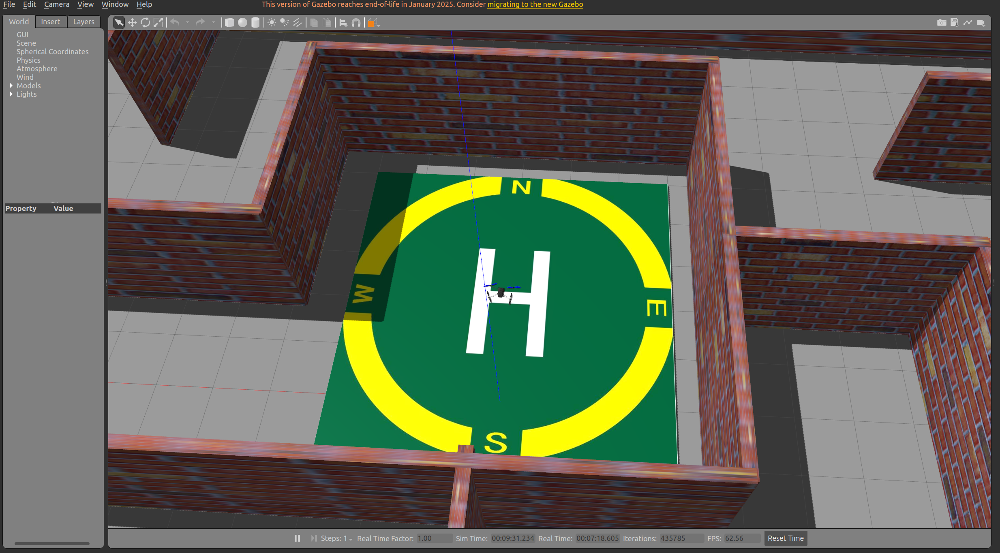
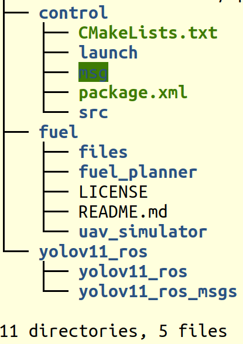
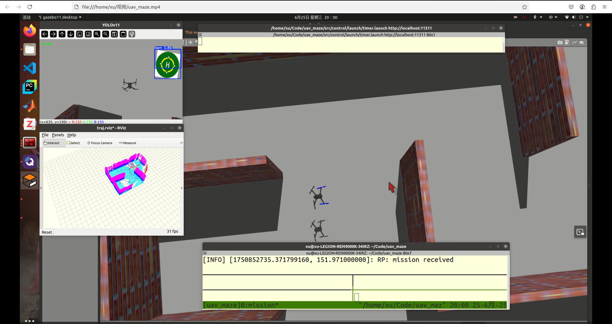
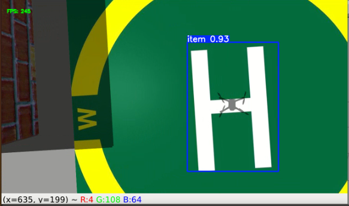
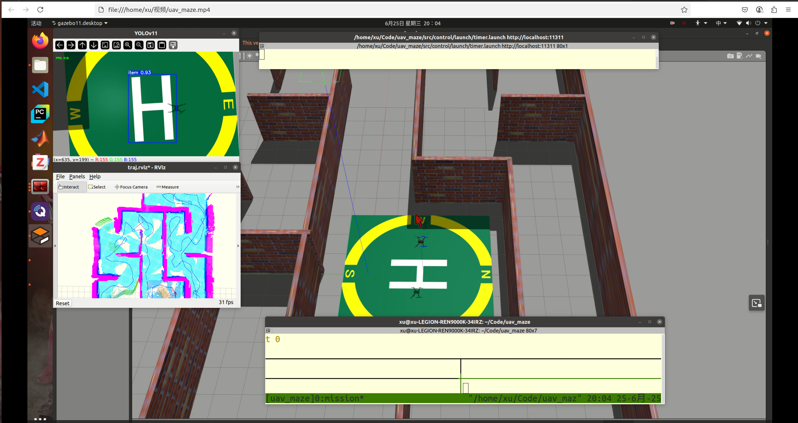
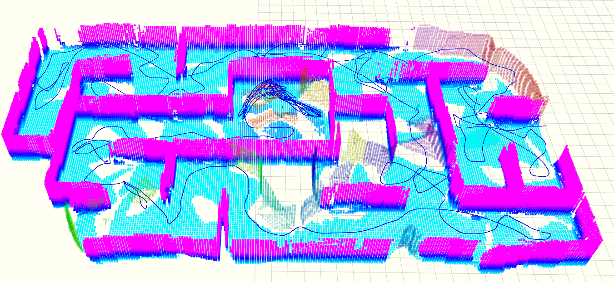

# 自主无人系统迷宫探索实验



## 📖 项目概述
本项目基于**Ubuntu 20.04**系统，实现四旋翼无人机在XTDrone仿真平台中的迷宫自主探索与精准降落任务。核心组件包括：
- 🚁 **XTDrone仿真平台**：[官方文档](https://www.yuque.com/xtdrone/manual_cn)
- 🔭 **自主探索算法**：港科大FUEL算法 [GitHub源码](https://github.com/HKUST-Aerial-Robotics/FUEL)
- 🔍 **目标检测**：YOLOv11算法 [官方文档](https://docs.ultralytics.com/zh/models/yolo11/)
- 📷 **传感器配置**：前置深度相机 + 下置单目相机

---

## 🎯 任务要求
1. 无人机从指定起点自主探索迷宫环境
2. 飞行高度始终**不超过3米**
3. 识别降落标志（H）后完成精准自主降落

---

## ⚙️ 实验流程
本项目实验方案流程：
1. 自主探索阶段 (FUEL算法)
2. 目标检测阶段 (YOLOv11识别'H')
3. 视觉伺服阶段
4. 精准降落

---

## 🛠️ 实验准备

### 1. XTDrone平台安装
建议使用语雀平台进行安装，也可以使用下面的Github拉取方法。
```bash
git clone https://github.com/robin-shaun/XTDrone.git
cd XTDrone
./setup.sh
```
**请注意需要修改无人机定位方式为视觉定位！！！请参照语雀平台中修改px4中EKF的方式**

### 2. YOLOv11环境配置
参考网上教程！

### 3. Iris机型配置
用于本实验的iris机型，在安装XTDrone平台时已经包含，若没有，请按照相应需要的传感器并参考语雀平台进行修改。

例如，修改SDF文件添加传感器：
```xml
<!-- 示例：深度相机配置 -->
<sensor name="depth_camera" type="depth">
  <camera>
    <horizontal_fov>1.047</horizontal_fov>
    <image>
      <width>640</width>
      <height>480</height>
    </image>
  </camera>
</sensor>
```

### 4. 模型训练数据集
本项目提供了相应的程序辅助进行数据集采集，见bag文件夹。
| 步骤 | 工具 | 输出 |
|------|------|------|
| 1. ROS话题录制 | `rosbag record` | .bag文件 |
| 2. 视频抽帧 | `image_generate.py` | 图像序列 |
| 3. 数据标注 | labelImg | XML标注文件 |
| 4. 数据集拆分 | `split_dataset.py` | train/val sets |
| 5. 模型训练 | yolov11s.pt | 预训练权重 |

> 训练好的模型路径：`uav_maze/src/yolov11_ros/weights/`

---

## 🚀 程序运行

### 系统架构图


### 操作步骤：
1. 启动QGroundControl地面站
2. 运行主启动脚本：
   ```bash
   sh start.sh
   ```
3. 无人机起飞悬停后启动FUEL：
   ```bash
   sh fuel.sh
   ```
4. 启动计时监控：
   ```bash
   roslaunch control timer.launch
   ```
---

## 📸 运行效果

### 探索阶段
 

### 识别


### 降落


### 建图


---

## 📧 技术交流
欢迎交流联系：📩 [zhangxu.nudt@nudt.edu.cn](mailto:zhangxu.nudt@nudt.edu.cn)  

祝你实验顺利！🎉
